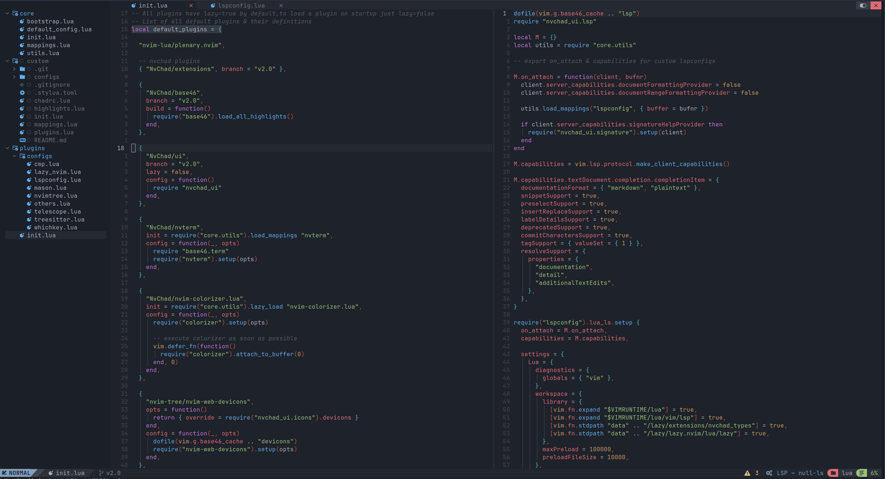

# My Neovim 


# Installation

### 1. Install Neovim > 0.8

Ubuntu: 

Install from [Tarball](https://github.com/neovim/neovim/releases/tag/stable)

```bash
wget ...  #  Download the latest `linux64.tar.gz`
sudo tar xzvf nvim-linux64.tar.gz -C /opt
sudo cp /opt/nvim-linux64/bin/nvim /usr/bin/ -s
```

Arch:

```bash
sudo pacman -S neovim
```

### 2. Get JetBrainsMono font.

```bash
wget https://github.com/ryanoasis/nerd-fonts/releases/download/v3.0.2/JetBrainsMono.zip
unzip -o JetBrainsMono.zip -d ~/.local/share/fonts/
rm JetBrainsMono.zip
```

### 3. Install NvChad. 

```bash
sudo rm -rf ~/.config/nvim
sudo rm -rf ~/.local/share/nvim
sudo rm -rf ~/.cache/nvim
git clone https://github.com/NvChad/NvChad ~/.config/nvim --depth 1 
```

### 4. Install Custom Config.

```
sudo rm -rf ~/.config/nvim/lua/custom
git clone git@github.com:kikefdezl/neovim-kikefdezl.git ~/.config/nvim/lua/custom --depth 1
nvim
```

### 5. LSP

Install desired tools running `:MasonInstallAll`
