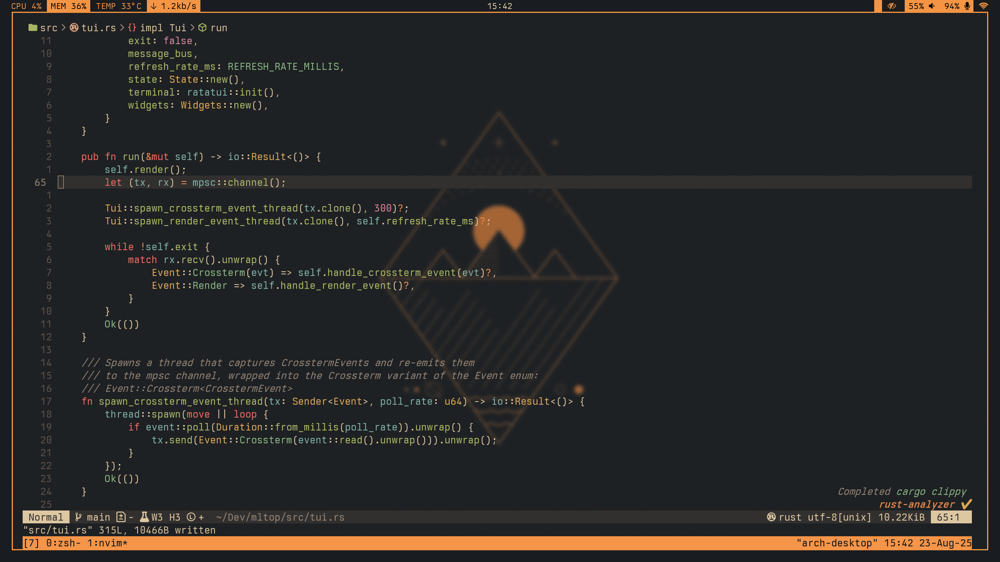

# My Neovim

These are the files for my own Neovim configuration, based on
[kickstart.nvim](https://github.com/nvim-lua/kickstart.nvim).



## Installation

### 1. Install Neovim

Neovim `>=0.11` is required.

#### Ubuntu

Install from [Tarball](https://github.com/neovim/neovim/releases/tag/stable)

```bash
wget ...  #  Download the latest `linux64.tar.gz`
sudo tar xzvf nvim-linux64.tar.gz -C /opt
sudo cp /opt/nvim-linux64/bin/nvim /usr/bin/ -s
```

#### Arch

```bash
sudo pacman -S neovim
```

### 2. Install Custom Config

(Optional) Remove previous configurations

```bash
rm -rf ~/.config/nvim
rm -rf ~/.local/state/nvim
rm -rf ~/.local/share/nvim
```

Install:

```bash
git clone git@github.com:kikefdezl/neovim.git ~/.config/nvim
nvim
```

### 3. Optional Requirements

* A nerd font, used by your terminal emulator, to visualize icons and symbols
